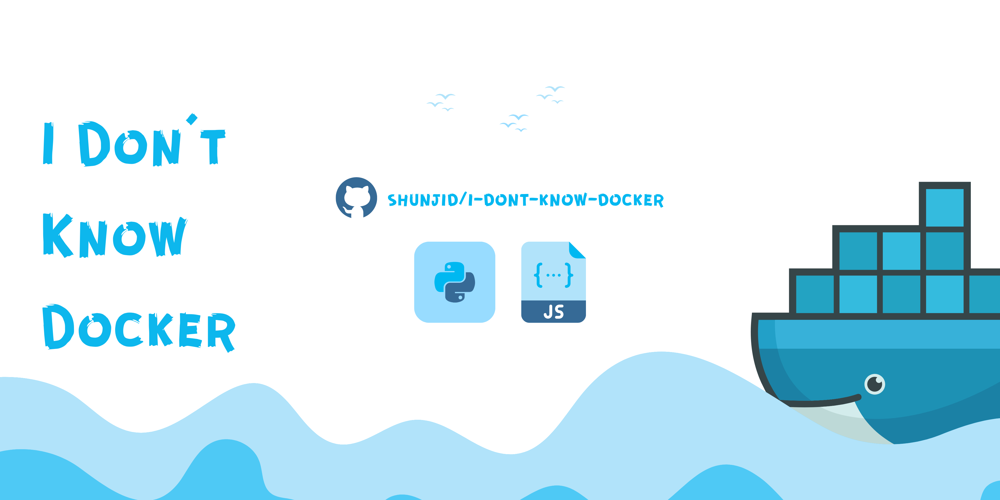
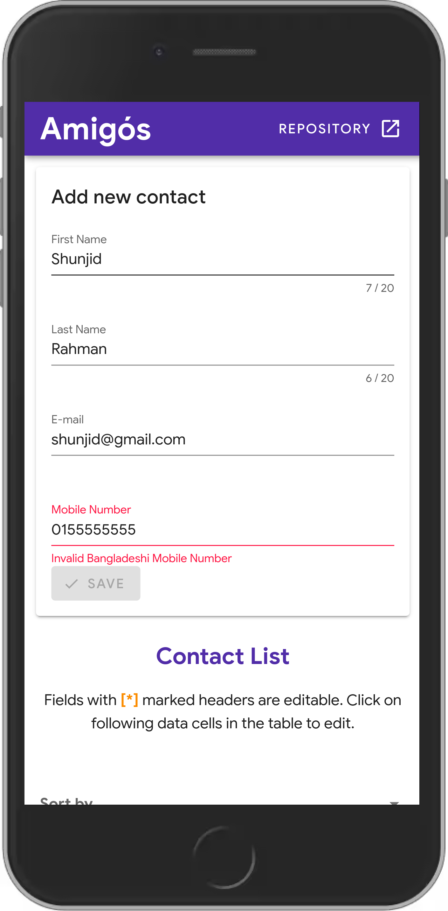
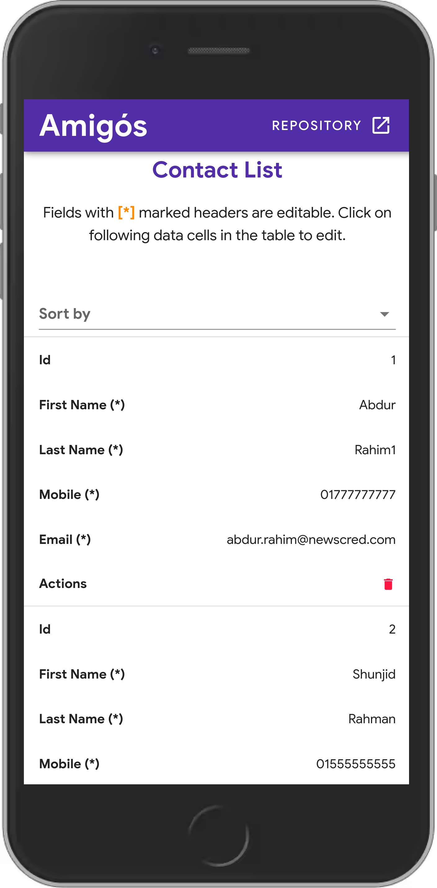
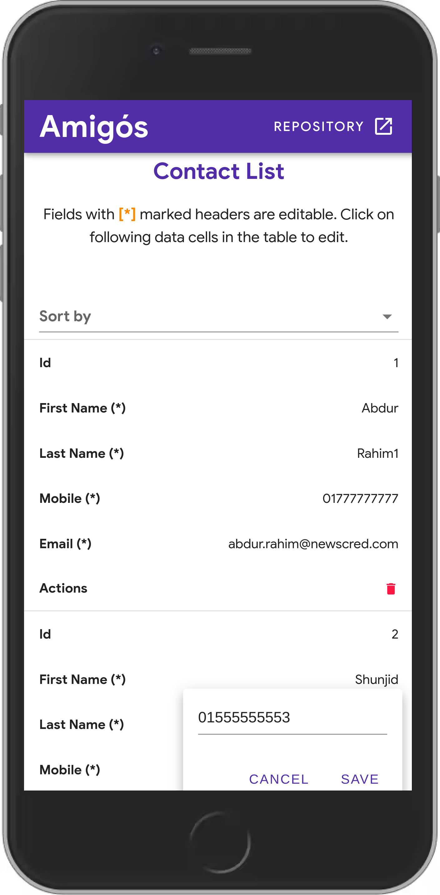
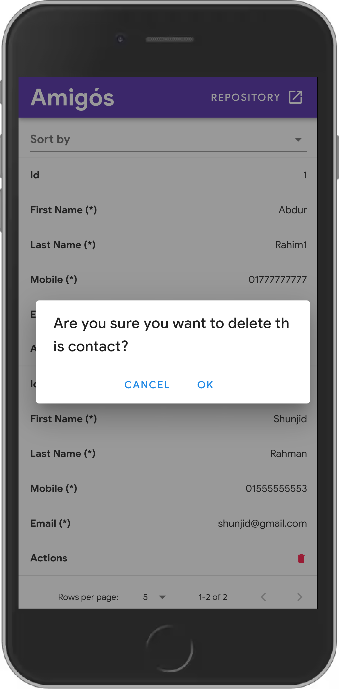
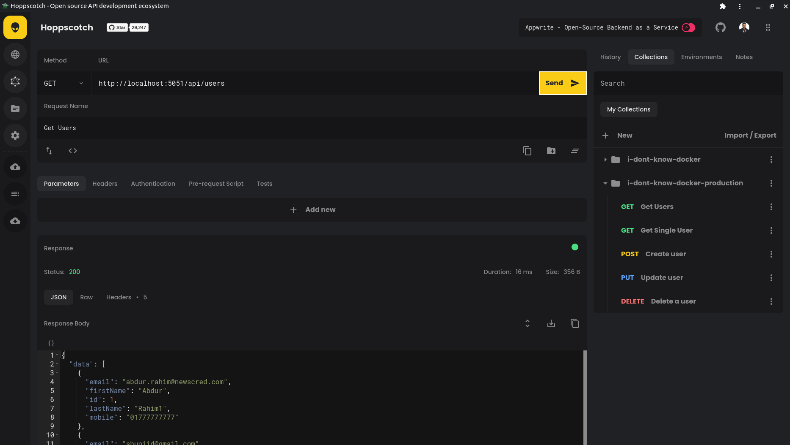

# :whale: **I-Dont-Know-Docker**

This project is one of the assignments of my internship @newscred. The main objective of this project is learning by working with docker. In the docker-compose.yml three services have been introduced with the dependency cycle **(Web --> API --> DB)**:

- **Web**: Single page application built using Vuetify.js and Vuex.
- **API**: REST API developed using Flask and Flask-SQLAlchemy.
- **DB**: MySQL Database version 8.0.25.

## **Prerequisite**

Make sure you have docker and docker-compose installed. Use these commands below to check:

```bash
$ docker --version

> Docker version 20.10.6
```

```bash
$ docker-compose --version

> docker-compose version 1.27.4
```

## **How to start**

To run this project open your terminal on the project's root directory and run the command below:

```bash
$ docker-compose up

> Build starts [....]
```

After building successfully, you can test the website by opening [http://localhost:5050/](http://localhost:5050/) on your browser which will route you to the homepage of the Vue.js single page application like the screenshots below 👇.

## **Screenshots**

| Add new user                                    | View Users                                       |
| ----------------------------------------------- | ------------------------------------------------ |
|  |  |

| Update inside table                                | Delete by confirmation                             |
| -------------------------------------------------- | -------------------------------------------------- |
|  |  |

## Testing APIs

To test the APIs, import this [Endpoint Collection](assets/utils/hoppscotch.json) at [https://hoppscotch.io/](https://hoppscotch.io/). Make sure, you have [hoppscotch extension](https://chrome.google.com/webstore/detail/hoppscotch-browser-extens/amknoiejhlmhancpahfcfcfhllgkpbld?hl=en) installed on your browser.


