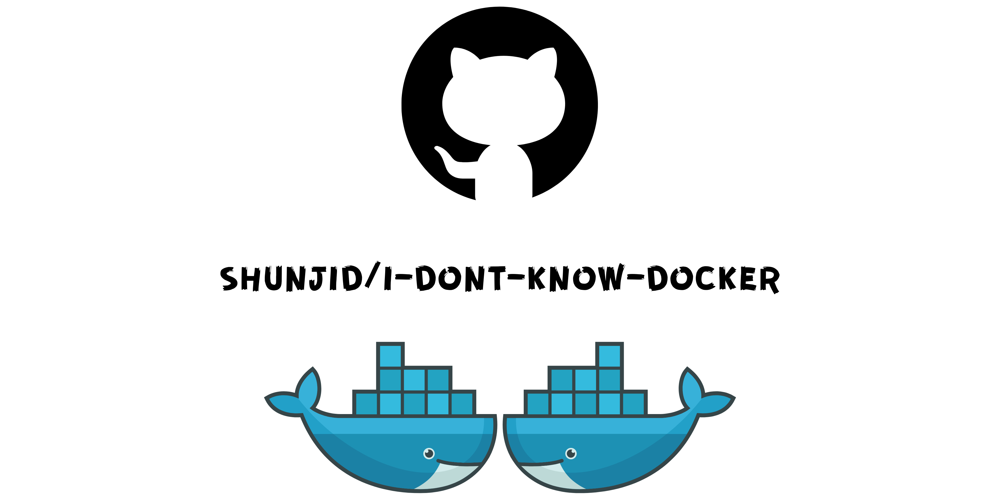

# **I Don't Know Docker**

This project is one of the assignments of my internship at [Welcome Software](https://github.com/newscred). The main objective of this project is to learn working with docker by doing practice. So far, my progress is:

- Created a REST API with flask.
- Worked with MySQL database using an ORM **FlaskSQL-Alchemy**.
- Applied _Separation of concerns_ design principle while structuring API.
- Created a Single Page Application using Vue.js [Working on React version].
- Used docker and docker-compose to run these services using containers:
  - SPA as a service.
  - API as a service.
  - Database as a service.

## **Screenshots**

| Add new user                        | View Users                           |
| ----------------------------------- | ------------------------------------ |
|  |  |

| Update inside table                    | Delete by confirmation                 |
| -------------------------------------- | -------------------------------------- |
|  |  |

## **Prerequisite**

Make sure you have docker and docker-compose installed. Use these commands below to check:

```bash
$ docker --version

> Docker version 20.10.6
```

```bash
$ docker-compose --version

> docker-compose version 1.27.4
```

## **How to start**

To run this project open your terminal on the project's root directory and run the command below:

```bash
$ docker-compose up

> Build starts [....]
```

After building successfully, you can test the website by opening:

```bash
http://localhost:5050/
```

on your browser which will route you to the homepage of the Single Page Application like the screenshots below 👇.

## Testing APIs

To test the APIs, import this [Endpoint Collection](assets/utils/hoppscotch.json) at [https://hoppscotch.io/](https://hoppscotch.io/). Make sure, you have [hoppscotch extension](https://chrome.google.com/webstore/detail/hoppscotch-browser-extens/amknoiejhlmhancpahfcfcfhllgkpbld?hl=en) installed on your browser.


## Dependency

In the docker-compose.yml three services have been introduced with the dependency cycle **(Web -> API -> DB)**:

- **Web**: Single page application built using Vuetify.js and Vuex.
- **API**: REST API developed using Flask and Flask-SQLAlchemy.
- **DB**: MySQL Database version 8.0.25.
