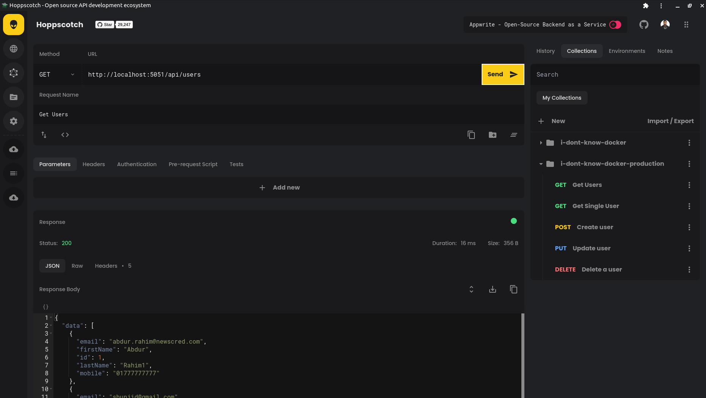

## Testing APIs

To test the APIs, import this [Endpoint Collection](../assets/utils/hoppscotch.json) at [https://hoppscotch.io/](https://hoppscotch.io/). Make sure, you have [hoppscotch extension](https://chrome.google.com/webstore/detail/hoppscotch-browser-extens/amknoiejhlmhancpahfcfcfhllgkpbld?hl=en) installed on your browser.

